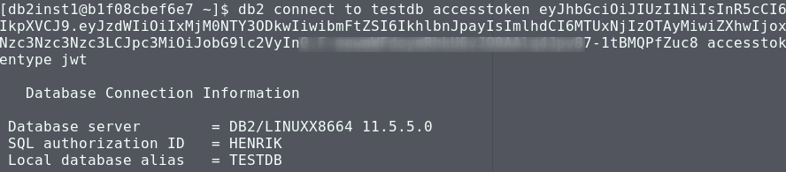
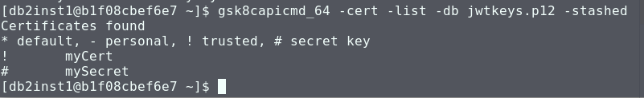
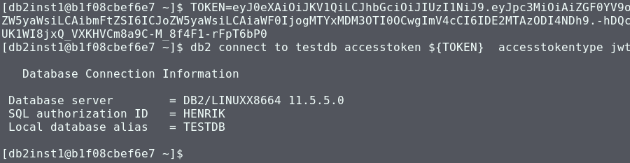

# Using JWT with Db2

Since V11.5.4, [Db2 allows to consume JWT (JSON Web Token)](https://www.ibm.com/support/knowledgecenter/SSEPGG_11.5.0/com.ibm.db2.luw.wn.doc/doc/security_enhancements-11-5-4.html). The business case is to support SSO (single sign-on). You can configure Db2 to accept access tokens issued by external Identity Provider (IDPs), including the [IBM solutions](https://www.ibm.com/security/identity-access-management) or open source projects like [gluu](https://www.gluu.org/). 

[V11.5.5 brought some usability improvements](https://www.ibm.com/support/knowledgecenter/SSEPGG_11.5.0/com.ibm.db2.luw.wn.doc/doc/security_enhancements-11-5-5.html), e.g., support for multiple labels. It allows to specify multiple token issuers with issuer allowed to reference multiple labels in the key database. The following is a short step-by-step guide on how to test this Db2 security feature with [your "own" JWTs](https://www.ibm.com/support/knowledgecenter/SSEPGG_11.5.0/com.ibm.db2.luw.admin.sec.doc/doc/c_token_jwt.html). When done, you can have use the Db2 CLP to login as shown below (and you should be ready to configure other Identity Providers as well...):




## Db2 configuration
To use Db2 with JWT, you need the right Db2 version and some changes to its security setup. Here are the necessary parts. I recommend to clone or download this repository to your machine, e.g., by:
```
git clone https://github.com/data-henrik/JWTutil
```

Thereafter, change into that directory.

### Db2 Docker
For my tests I have used the latest [Db2 Docker image](https://hub.docker.com/r/ibmcom/db2). To download and start it, use a command like the following ("db storage dir" is your local directory to hold Db2 data):

```
docker run -itd --name mydb2 --privileged=true -p 50000:50000 -e LICENSE=accept -e DB2INST1_PASSWORD=<choose an instance password> -e DBNAME=testdb -v <db storage dir>:/database ibmcom/db2
```

Personally, I am utilizing podman and started Db2 like this:
```
sudo podman run -itd --name mydb2 --privileged=true -p 50000:50000 -e LICENSE=accept -e DB2INST1_PASSWORD=foobar -e DBNAME=testdb  ibmcom/db2:11.5.5.0  -v /home/hloeser/progs/db2/database:/database:O,suid
```

The instructions for the Docker image also provide the command to log in to the Db2 instance:
```
docker exec -ti mydb2 bash -c "su - ${DB2INSTANCE}"
```

In my setup, it translates to:
```
sudo podman exec -ti mydb2 bash -c "su - db2inst1"
```
### Key database, keys, certificates
Next on the list is the configuration of Db2 security. It requires [creation of a keystore with GSKit](https://www.ibm.com/support/knowledgecenter/SSEPGG_11.5.0/com.ibm.db2.luw.admin.sec.doc/doc/t_create_keystore_gskit.html) and a [Db2 token configuration file](https://www.ibm.com/support/knowledgecenter/SSEPGG_11.5.0/com.ibm.db2.luw.admin.sec.doc/doc/c_token_config.html).

The Db2 includes a copy of the [IBM Global Security Kit](https://www.ibm.com/support/knowledgecenter/SSEPGG_11.5.0/com.ibm.swg.tivoli.gskit.install.doc/doc/c0055353.html). It is used to handle keystores and cryptographic tasks related to native data encryption, SSL/TLS certificates and also for the JWT (cryptographic) signatures. [JWTs can be signed and verified using either symmetric (shared key) encryption or by utilizing public / private key algorithms](https://www.ibm.com/support/knowledgecenter/SSEPGG_11.5.0/com.ibm.db2.luw.admin.sec.doc/doc/c_token_jwt.html). In the following, I am showing how to use both.

While being logged in to the Db2 container (server environment), perform the following in the shell:
1. Create the keystore for the token certification. You may want to change the password to your standards.
    ```
    gsk8capicmd_64 -keydb -create -db "jwtkeys.p12" -pw passw0rd -type pkcs12 -stash
    ```
2. Create a file "mykey.txt" holding the secret passphrase for the shared key. I stored "myreallysecretkey12345678901234567890" as secret. Thereafter, add that secret to the keystore. (Important: It will be converted to Base64 encoding.)
    ```
    gsk8capicmd_64 -secretkey -add -db jwtkeys.p12 -stashed -label "mySecretKey" -file mykey.txt
    ```
3. Now, generate a private RSA key and store it as PEM file. You can leave the passphrase empty (just hit "ENTER").
    ```
    ssh-keygen -t rsa -b 4096 -m PEM -f jwtRS256.key
    ```
4. Generate a certificate for that key. Enter values related to your location and organization, or something random.
    ```
    openssl req -x509 -new -nodes -key jwtRS256.key -sha256 -days 1825 -out myCert.pem
    ```
5. Add that certificate to the keystore:
    ```
    gsk8capicmd_64 -cert -add -db jwtkeys.p12 -stashed -label "myCert" -file myCert.pem
    ```
6. Verify that the keystore holds both the secret (key) and the certificate. It should show the two items from above and indicate their types and print the labels.
    ```
    gsk8capicmd_64 -cert -list -db jwtkeys.p12 -stashed
    ```




### Configure Db2 for JWT
With the above keystore and its items in place, it is time again to turn to Db2.

1. Create a file sqllib/cfg/db2token.cfg with the content as shown in [db2token.cfg](db2token.cfg). The parts of the [token configuration file](https://www.ibm.com/support/knowledgecenter/SSEPGG_11.5.0/com.ibm.db2.luw.admin.sec.doc/doc/c_token_config.html) tell Db2 where to find the keystore and how to verify received JWTs. It defines the issuer "data_henrik" and that it uses the field "name" to identify the user. Thereafter, it makes the labels for the secret key and for the RSA certificate known. Note that only one of them is required, but we are going to test both symmetric / shared key as well as the asymmetric public / private key algorithms.
2. Update Db2 to enable [token-based authentication](https://www.ibm.com/support/knowledgecenter/SSEPGG_11.5.0/com.ibm.db2.luw.admin.config.doc/doc/r0011454.html). The configuration is set to the combination of SERVER_ENCRYPT and TOKEN.
    ```
   db2 update dbm cfg using SRVCON_AUTH SERVER_ENCRYPT_TOKEN
    ```
3. Stop and restart Db2. If there is no error message, everything is fine. Else check the diagnostic output under sqllib/db2dump/..../db2diag.log:
    ```
    db2stop
    db2start
    ```

Later, if you have edited db2token.cfg, you can use the administrative procedure [ADMIN_REFRESH_CONFIG](https://www.ibm.com/support/knowledgecenter/SSEPGG_11.5.0/com.ibm.db2.luw.sql.rtn.doc/doc/r_admin_rc.html) to reload (refresh) the configuration:

```
db2 "call sysproc.admin_refresh_config('token')"
```

## Generate JWT and login
At this point, Db2 has been set up for JWT-based login. Now it is time for testing. But where to get the right JWT...?

No panic, the Python script [JWTutil.py](JWTutil.py) is here to help. See the [README.md](README.md) for the available command options. It allows to generate signed JWTs using either HS256 (symmetric / shared key) or RS256 (asymmetric public / private key) algorithms. The JWT payload is defined in [this line](JWTutil.py#L17) and you can modify it later on in sync with the Db2 configuration.

Use a non-Db2 shell in your machine where you have the tool available.

1. Base64-encode the secret key:
    ```
    echo "myreallysecretkey12345678901234567890" | base64
    ```
    It should report "bXlyZWFsbHlzZWNyZXRrZXkxMjM0NTY3ODkwMTIzNDU2Nzg5MAo=".
2. Generate a JWT for that key. If Python is not found use "python JWTutil.py ...":
    ```
    ./JWTutil.py  -s bXlyZWFsbHlzZWNyZXRrZXkxMjM0NTY3ODkwMTIzNDU2Nzg5MAo=
    ```
    It should print a message starting with "Token using HS256:" followed by the actual token on the next line.
3. Set an environment variable with the (full!) token from above.
    ```
    TOKEN=eyJ0eXAiOiJKV1QiLCJhbGciOi....
    ```
4. Connect to Db2 using that token which is read from the variable:
    ```
    db2 connect to testdb accesstoken ${TOKEN}  accesstokentype jwt
    ```
    
5. You might want to verify the connected user:
    ```
    db2 "values(current user)"
    ```
6. Terminate the connection for the next test.
    ```
    db2 terminate
    ```

The above steps cover using the symmetric key. It is simpler, but less secure. The steps for using the public / private key algorithm are similar.

1. Copy over the file with the private key, "jwtRS256.key" from the Db2 environment.
2. Generate the JWT:
    ```
    ./JWTutil.py -k jwtRS256.key
    ```
   With the output showing the token using RS256 follow the steps 3-6 from above.

For both tokens the expiration is set to one hour after they were created. Thus, if you wait or retry to connect after more than one hour, you should see an error message indicating the expiration:

> SQL30082N  Security processing failed with reason "52" ("ACCESS TOKEN EXPIRED").  SQLSTATE=08001

The error [SQL30082N](https://www.ibm.com/support/knowledgecenter/SSEPGG_11.5.0/com.ibm.db2.luw.messages.sql.doc/com.ibm.db2.luw.messages.sql.doc-gentopic27.html#sql30082n) has several reason codes related to access tokens.

The Db2 diagnostic log has entries related to those errors, too.
```
EDUID   : 23                   EDUNAME: db2agent (TESTDB) 0
FUNCTION: DB2 UDB, bsu security, sqlexVerifyJWT, probe:788
MESSAGE : ZRC=0x805C0BDC=-2141451300=SQLEX_ACCESS_TOKEN_EXPIRED
          "The access token has already expired."
DATA #1 : String, 30 bytes
JWT token has already expired.
```


# Notes
- You can use multiple issuers in db2token.cfg, each with one or more types and labels. 
- Instead of utilizing the Python script, there are several websites like [https://jwt.io/](https://jwt.io/) which offer online encoding and decoding of JWTs.
- The tool JWTutil.py is able to decode a JWT and print its payload. See [README.md](README.md) for details.
